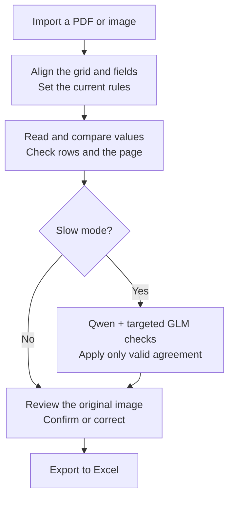

# TableScan Local

**Turn scanned or photographed tables into editable Excel workbooks.**

TableScan reads printed and handwritten values, lets you check them against the
original image, and exports the result to `.xlsx`. Documents and recognition
stay on your computer. No online account is needed to use the application.

[Download](https://github.com/savvykitt-create/tablescan-local/releases/latest) ·
[Installation](#installation) · [First table](#your-first-table) ·
[How it works](#how-recognition-works) · [Developer guide](docs/development.md)

## Installation

Download the file for your computer from the
[latest release](https://github.com/savvykitt-create/tablescan-local/releases/latest).
Expand **Assets** to see the installers.

| Computer | Download | Install |
| --- | --- | --- |
| Windows, 64-bit | `Setup-x64.exe` | Run the installer, then open **TableScan Local** from Start. |
| Mac with Apple Silicon | `macOS-arm64.dmg` | Open the disk image and copy **TableScan Local** to Applications. |
| Mac with Intel | `macOS-x86_64.dmg` | Open the disk image and copy **TableScan Local** to Applications. |
| Ubuntu, 64-bit Intel/AMD | `amd64.deb` | Install the package, then open **TableScan Local** from the application menu. |

The names above are the endings of the versioned filenames. On a Mac, **Apple
menu → About This Mac** identifies the chip or processor.

The installers include Python and the standard recognition models. A separate
Python installation and a graphics card are **not required for standard use**.
For a source installation, follow the [developer guide](docs/development.md).

## Your first table

1. **Open a document.** Import a PDF or a PNG, JPEG or TIFF image. Multi-page
   documents are supported.
2. **Align the table.** In **Alignment**, select a saved template or adjust the
   table boundary, rows and columns to match the page. Use **Fields** for items
   outside the grid, such as a date or sample name.
3. **Set the rules.** In **Rules**, specify the expected value type, decimal
   places and allowed range for the relevant columns or cell blocks. Check the
   current settings before starting. Save a template to reuse the layout and rules.
4. **Run recognition.** Choose the options in **Alignment → Grid**, then start
   processing. The standard models are ready to use after installation.
5. **Review the result.** Select a flagged cell or field, compare it with the
   original crop, and confirm or correct the value. **Why review is needed**
   shows alternative readings and the reason for the flag. If a row was wrongly
   excluded, clear **Exclude this row** to restore its measurements.
6. **Export to Excel.** Resolve flagged values and rule errors, then select
   **Export to Excel**. **Compact** keeps the page layouts; **Extended** also
   includes normalized **Data** and detailed **Audit** sheets.

In review, **Enter** confirms the value and advances; **Alt+Right** moves to the
next disputed value without confirming it. Set the interface language under
**Settings → Language**: English, Czech or Russian.

## How recognition works

The diagram describes processing for each page. A template defines **where to
read** and **which values are allowed**; it does not supply the correct answers.

Blank-cell and row-mark checks distinguish missing or cancelled measurements
from numbers. The program also uses clearer digits on the same page as handwriting
evidence and flags unusual values.

In Slow mode, Qwen reads the numeric table; GLM checks rows where Qwen proposes
an eligible change to a disputed value. Disagreement or a failed check keeps the
existing reading. Changed proposals still require review. This step preserves
text fields, identifiers, excluded measurements and manually confirmed values.

Recognition can still confuse similar digits or miss faint strokes. A value
fitting the rules—or agreement between models—is not proof that it matches the
source. Use the original-image preview to verify important measurements.

## Recognition options

These controls are in **Alignment → Grid**.

| Option | Effect | Additional setup |
| --- | --- | --- |
| **Detect crossed-out rows** | Detects cancelled rows and excludes their measurements. Exclusion can be reversed during review. | None |
| **Maximum accuracy (slower)** | Uses extra recognition passes and candidate checks for numeric cells. | None |
| **Slow mode — additional verification** | Adds Qwen/GLM checks for disputed numeric values; also enables Maximum accuracy. | Install the optional models once. |

### Set up Slow mode

On **Windows**, install 64-bit Python 3.12 with its launcher, then open
**Start → TableScan Local → Install or repair slow mode**. Choose **Auto**,
**CPU only** or **NVIDIA CUDA**. The setup downloads the models and runs a
self-test. Auto uses a suitable NVIDIA GPU when available and falls back to CPU.

For CPU use, plan for at least **16 GB RAM** (24 GB or more recommended) and
about **15 GB free disk space**. Processing can take substantially longer than
standard recognition; the time depends on the computer and table size.

On **Apple Silicon Macs**, the optional module uses MLX. Installation commands,
requirements and troubleshooting for all platforms are in the
[Slow mode guide](docs/slow-mode.md). Internet is needed for setup; subsequent
recognition runs offline. The downloaded models survive application updates.

## Your files and updates

Original documents are never modified. Imported copies, templates and processing
results are stored in your operating system's user application-data directory.
The application does not upload documents, image crops or recognized values.

To update an installed application, download the new installer for the same
platform. Reinstalling the application does not erase your saved work or settings.
For source updates, see the [developer guide](docs/development.md#update).

## Project information

- [Release notes and downloads](https://github.com/savvykitt-create/tablescan-local/releases)
- [Development, tests and packaging](docs/development.md)
- [Model sources and checksums](src/tablescan_local/models/README.md)

Application source code is licensed under [Apache-2.0](LICENSE). Dependencies
and model weights retain their upstream licenses; see
[Third-party notices](THIRD_PARTY_NOTICES.md).
