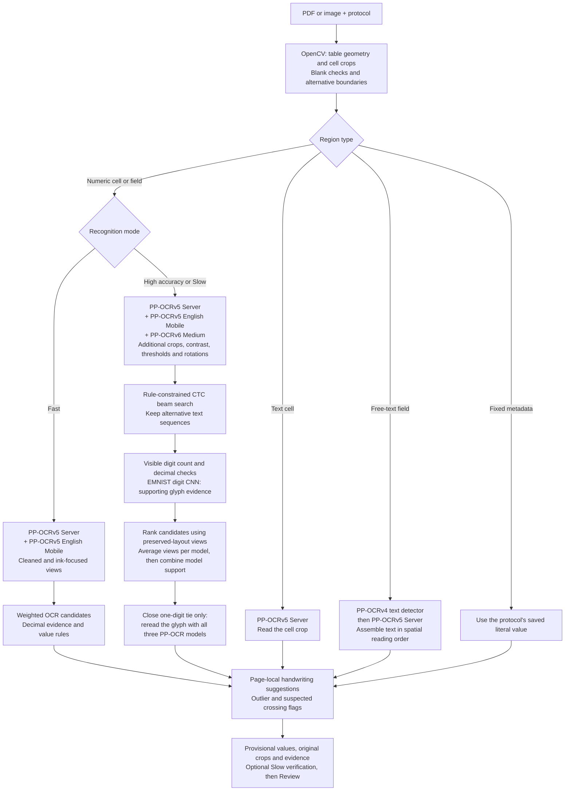
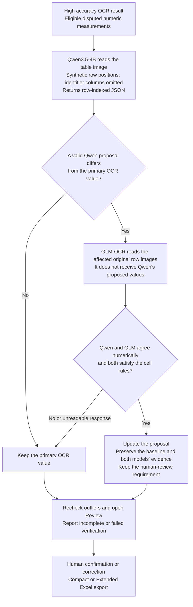

# TableScan Local

Turn scanned or photographed tables into editable Excel workbooks. Recognize
printed and handwritten values, check them against the original, and export the
results. Processing stays on your computer; no online account is required.

[Download](https://github.com/savvykitt-create/tablescan-local/releases/latest) ·
[Installation](#installation) · [Usage](#your-first-table) ·
[Algorithm and models](#how-recognition-works) ·
[Development](docs/development.md)

## Installation

Download the file for your computer from the
[latest release](https://github.com/savvykitt-create/tablescan-local/releases/latest).
Expand **Assets** to see the installers. Current updates target Windows x64 and
Apple Silicon macOS.

| Computer | Download | Install |
| --- | --- | --- |
| Windows, 64-bit | `Setup-x64.exe` | Run the installer, then open **TableScan Local** from Start. |
| Mac with Apple Silicon | `macOS-arm64.zip` (or `.dmg`) | Extract the ZIP (or open the disk image), then copy **TableScan Local.app** to Applications. |

The names above are the endings of the versioned filenames. On a Mac, **Apple
menu → About This Mac** identifies the chip or processor.

The installers include Python and the standard recognition models. A separate
Python installation and a graphics card are **not required for standard use**.
For a source installation, follow the [developer guide](docs/development.md).

### First launch on macOS

The default GitHub macOS build has an ad hoc signature, but is **not signed with
Apple Developer ID or notarized**. macOS may block its first launch because the
developer cannot be verified. This is an expected installation limitation.

If you trust the release downloaded from this repository:

1. Extract the ZIP (or open the DMG), copy **TableScan Local.app** to **Applications**, then try opening it.
2. If macOS blocks it, open **System Settings → Privacy & Security**.
3. Scroll to **Security**, find the message about TableScan Local and select
   **Open Anyway**. Authenticate and confirm opening when prompted.

This creates an exception for this application. See
[Apple's instructions](https://support.apple.com/en-ca/guide/mac-help/mh40616/mac).
Managed computers may prevent this exception. Developer ID signing and notarization
are an [optional release mode](docs/macos-release-signing.md).

## Your first table

1. **Files:** open a PDF, PNG, JPEG or TIFF. Multiple files and multipage PDFs
   are supported.
2. **Alignment:** choose a protocol and check the detected rotation, boundary,
   rows and columns. Adjust the grid if needed. Mark metadata outside the grid
   under **Fields** and configure expected values under **Rules**.
3. **Analyze:** choose Fast, High accuracy or Slow analysis. Standard recognition
   models are included; install optional Slow analysis from **Settings → Slow mode →
   Install Slow mode**. Windows downloads Python and the models automatically.
4. **Review:** compare flagged values with their original crops. Edit and press
   **Enter** to confirm and continue, or **Alt+Right** to skip to the next disputed
   value. Handwriting suggestions appear below the main actions; **Alt+A** copies
   a suggestion into the editor for checking.
5. **Export:** after review, choose **Compact** for the original table layouts
   plus **Fields**, or **Extended** for layouts, normalized **Data** and **Audit**.

Rules guide recognition. Individual manual corrections override cell and field
rules, including numeric limits and decimal formats. Bulk confirmation still
leaves rule conflicts for individual review. **Exclude this row** and
**Exclude this column** omit measurements; clearing an exclusion restores them.

Choose English, Czech or Russian in **Settings → Language**. Document contents
and custom protocol names remain in the language in which you entered them.

## Process multiple files

Select or drop several files to open batch preparation. Each file automatically
selects its highest-scoring protocol. Compatibility describes layout matching,
not recognition accuracy or identification of the experiment.

Inspect the preview with its grid overlay before submitting. You can apply one
protocol to all files, select another per file, or open a file to correct its
rotation, grid, fields and rules. Uncertain fits require checking. The inspected
settings are saved separately for each analysis. Choose **Blank protocol** to
create a protocol from scratch, including when the template library is empty.
The file editor's **Save as new template** adds the current settings to the
library as a separate template and makes it available to the other batch files.

Analyses run sequentially. You can prepare another batch or review completed
results while processing continues. The **Analysis queue** shows progress,
preparation details and colored statuses. **×** removes a task and stops it if
running; saved results remain in file history. **Cancel all** stops unfinished
work, and **Resume all** restarts cancelled, interrupted or failed tasks from
the beginning. Tasks removed with **×** are not resumed.

**Prepare selected file…** repeats preparation for only the selected file;
**Prepare files again…** prepares all files still in the queue. Previous results
remain in file history. **Export all ready files…** exports every file currently
ready for export into one selected folder, with one workbook per file and a
shared Compact or Extended format. Files awaiting review are skipped. Existing
workbooks are preserved by adding a numeric suffix to duplicate names.

Quitting the application interrupts unfinished analyses. They remain stopped
until you resume them. Closing only the queue window keeps processing running.

## Printable laboratory forms

**Von Frey, Plantar and Staircase** protocols are included. Their editable Excel
forms start with 20 animals, numbered IDs, distinct L/R header colors and a wide
Notes column. Insert or delete complete data rows before printing.

The protocol fits any detected animal count within the **200 total grid-row
limit**, including the header: with one header row, 1–199 animals. Counts such as
41 or 57 do not need a separate protocol. Keep column order and proportions,
uniform data-row heights and a consistent header. Scan quality must allow the
individual boundaries to be detected; check the fit preview.

Download [Excel forms](examples/lab_forms_excel/xlsx),
[protocol JSON files](examples/lab_forms_excel/templates), or the forms ZIP from
[Downloads](https://github.com/savvykitt-create/tablescan-local/releases/latest).
See the [printing guide](examples/lab_forms_excel/README.md). Pages with different
grids or animal counts must be analyzed as separate files.

## Recognition modes

| Mode | Use |
| --- | --- |
| Fast | Standard local OCR with fewer passes. |
| High accuracy | Additional OCR models, crop variations and candidate checks. |
| Slow | High accuracy followed by Qwen/GLM verification of disputed numeric measurements. |

Slow mode is optional. See [installation and troubleshooting](docs/slow-mode.md)
for Apple Silicon, Intel Mac, Windows and Linux. Its models download during setup
and subsequently run offline.

A slow-verification warning means that a model failed or its answer could not
be reliably mapped to rows and columns. The primary OCR result is preserved;
inspect the queue details and review the affected values. Model agreement and
confidence scores do not guarantee a correct handwritten reading.

## How recognition works

The application separates **page preparation**, **cell recognition**, **optional
model verification** and **human review**. A protocol supplies the grid, metadata
regions and expected value formats. OpenCV detects table lines and fits the
protocol to them; a language model does not decide the primary cell boundaries.
In batch preparation, each file is checked at 0°, 90°, 180° and 270°, scored
against available protocols and previewed before analysis. Each queued job keeps
its own inspected settings.

### 1. Primary recognition

The diagram shows the reading paths. All bundled OCR models run on CPU through
RapidOCR and ONNX Runtime. Branches describe different input types and modes;
they do not imply simultaneous model execution.

**Fast recognition** collects readings from two models and combines their
confidence with numeric format and visible decimal evidence. When a decimal mark
can be located, the integer and fractional parts can also be read separately.
Blank detection checks alternative crops so a clipped primary crop alone does
not erase a visible digit.

**High accuracy** adds PP-OCRv6 Medium and more views of each numeric crop.
CTC decoding retains several possible text sequences rather than only the first
answer. Rules restrict candidate selection; digit geometry and the EMNIST
verifier provide additional evidence. Final ranking averages distinct
layout-preserving views within each model, then combines model support using a
geometric mean. Thresholds and rotated crops help discover candidates but do not
each count as an independent final vote. A close one-digit disagreement may
trigger a separate glyph reading by all three OCR recognizers.

After cell recognition, a **temporary handwriting profile** compares stable digit
examples from other cells on the same page with existing OCR alternatives. It
produces suggestions for explicit confirmation, not automatic replacements or
new model weights. Suspected crossed-out rows and unusual values receive review
flags; only the reviewer decides to exclude a row or column.

### 2. Optional Slow verification

Slow analysis first completes High accuracy recognition. It then checks disputed
numeric or integer measurements outside headers, identifier columns and excluded
areas. Free-text fields and complex numeric expressions are not checked by this
stage. If there are no eligible measurements, additional inference is skipped.

Qwen and GLM run sequentially in separate worker processes and load local model
files. They receive image crops and prompts, not the user's reference answers.
Missing or invalid Qwen readings are retried once using exact cell crops.
GLM rows with missing values are retried on the individual disputed cells. Neither
model receives the other model's proposed answers. Rows are never padded,
truncated or shifted to fit the expected column count. Responses that remain
unreadable, conflict with protocol rules or fail at runtime leave primary OCR
available and produce diagnostic details. If the details report rejected values,
check the file's numeric ranges and formats; model agreement does not override
those constraints. Agreement changes a
proposal; it does not confirm the measurement or remove the need for review.

### Models and their roles

| Model or component | Role | When used | Runtime / distribution |
| --- | --- | --- | --- |
| **PP-OCRv5 Server** — `ch_PP-OCRv5_rec_server.onnx` | Main recognizer for printed text and handwritten/numeric candidates. | Fast, High accuracy and the primary pass of Slow. | Bundled; RapidOCR / ONNX Runtime, CPU. |
| **PP-OCRv5 English Mobile** — `en_PP-OCRv5_rec_mobile.onnx` | Additional numeric reading to compare with the main recognizer. | Numeric recognition in all modes. | Bundled; RapidOCR / ONNX Runtime, CPU. |
| **PP-OCRv6 Medium** — `PP-OCRv6_medium_rec.onnx` | Third numeric recognizer for candidate discovery and corroboration. | High accuracy and Slow. | Bundled; RapidOCR / ONNX Runtime, CPU. |
| **PP-OCRv4 text detector** — `ch_PP-OCRv4_det_infer.onnx` | Locates text lines inside a free-text metadata region before PP-OCRv5 reads them. It does not detect the table grid. | Free-text fields. | Included through RapidOCR; ONNX Runtime, CPU. |
| **EMNIST digit CNN** — `emnist_digit_cnn.onnx` | Supporting check of safely segmented digits; cannot independently override strong multi-model OCR evidence. | High accuracy and its handwriting suggestions; also included in Slow's primary pass. | Bundled project-trained verifier; ONNX Runtime, CPU. |
| **Qwen3.5-4B** | Reads the measurement table and proposes alternative values with row positions. | Optional Slow verification. | Apple Silicon: `mlx-community/Qwen3.5-4B-MLX-4bit` on MLX / Metal. Other platforms: `Qwen/Qwen3.5-4B` on Transformers / PyTorch, CPU or NVIDIA CUDA. |
| **GLM-OCR** | Independently reads original rows where Qwen proposes a different admissible value. | Optional Slow verification, after Qwen. | Apple Silicon: `mlx-community/GLM-OCR-bf16` on MLX / Metal. Other platforms: `zai-org/GLM-OCR` on Transformers / PyTorch, CPU or NVIDIA CUDA. |

The page-local handwriting profile is an algorithm using existing models and
examples from the current page, not an additional downloaded model. The standard
models ship with the application; Qwen and GLM require the optional setup.
Model sources, pinned revisions and checksums are documented in the
[model manifest](src/tablescan_local/models/README.md) and
[Slow runtime configuration](src/tablescan_local/slow_runtime.py).

### Review, export and execution boundaries

Jobs run one at a time in the background while the Qt interface remains
available for preparation and review. Results retain the original reading,
proposed value, alternatives, flags and model evidence. Individual manual
corrections override recognition rules and retain their entered precision on
export; they do not silently retrain the recognizers. Compact export contains
the source-layout sheets and Fields; Extended adds normalized Data and Audit
alongside the layouts.

Compatibility percentages describe layout matching. OCR confidence and candidate
ranking scores are not calibrated probabilities that a handwritten value is
correct. For decoding details and source references, see the
[technical algorithm guide](docs/recognition.md),
[handwriting profile](docs/writer-profile.md) and [value rules](docs/VALUE_RULES.md).

## Files, updates and development

Original files are not modified. Imported copies, protocols, results and settings
are stored in the operating system's application-data directory. Installing an
updated application preserves this data and optional downloaded models.

- [Source installation, tests and packaging](docs/development.md)
- [Model sources and checksums](src/tablescan_local/models/README.md)
- [Third-party notices](THIRD_PARTY_NOTICES.md)

Application code is licensed under [Apache-2.0](LICENSE). Dependencies and model
weights retain their upstream licenses.
