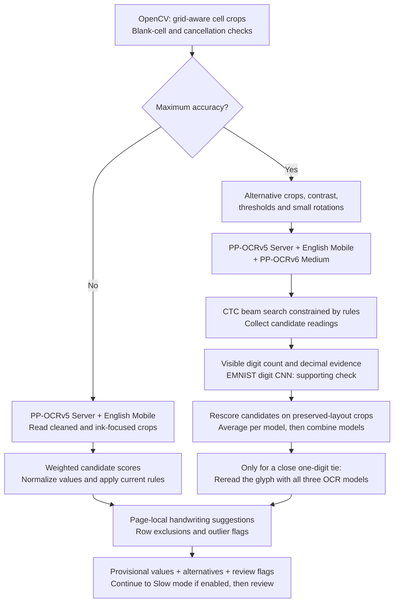
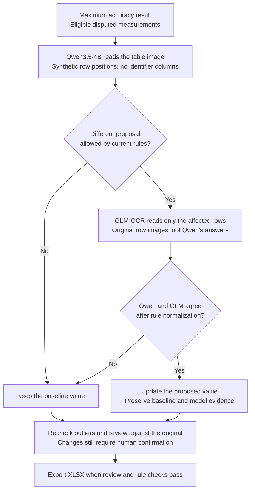

# TableScan Local

## Laboratory templates and printable Excel forms

**Von Frey, Plantar and Staircase** are available automatically on first launch.
Each has an editable Excel form with 20 numbered animals, blue L headers,
peach R headers and a wide Notes column. Insert or delete whole data rows
inside the Excel table; the same OCR template fits 5, 10, 15, 20, 30 or 40
animals when the columns and uniform row heights are preserved.

Download the forms ZIP from the [latest release](https://github.com/savvykitt-create/tablescan-local/releases/latest),
or use the [XLSX files](examples/lab_forms_excel/xlsx),
[JSON templates](examples/lab_forms_excel/templates) and
[printing and export instructions](examples/lab_forms_excel/README_RU.md).
Print landscape A4, fill by hand, scan the complete page, apply the matching
template, review OCR and export the populated table to Excel. Handwriting
still requires review. Different row counts within one PDF need separate jobs.

**Turn scanned or photographed tables into editable Excel workbooks.**

TableScan reads printed and handwritten values, lets you check them against the
original image, and exports the result to `.xlsx`. Documents and recognition
stay on your computer. No online account is needed to use the application.

[Download](https://github.com/savvykitt-create/tablescan-local/releases/latest) ·
[Installation](#installation) · [First table](#your-first-table) ·
[How it works](#how-recognition-works) · [Developer guide](docs/development.md)

## Installation

Download the file for your computer from the
[latest release](https://github.com/savvykitt-create/tablescan-local/releases/latest).
Expand **Assets** to see the installers.

| Computer | Download | Install |
| --- | --- | --- |
| Windows, 64-bit | `Setup-x64.exe` | Run the installer, then open **TableScan Local** from Start. |
| Mac with Apple Silicon | `macOS-arm64.dmg` | Open the disk image and copy **TableScan Local** to Applications. |
| Mac with Intel | `macOS-x86_64.dmg` | Open the disk image and copy **TableScan Local** to Applications. |
| Ubuntu, 64-bit Intel/AMD | `amd64.deb` | Install the package, then open **TableScan Local** from the application menu. |

The names above are the endings of the versioned filenames. On a Mac, **Apple
menu → About This Mac** identifies the chip or processor.

The installers include Python and the standard recognition models. A separate
Python installation and a graphics card are **not required for standard use**.
For a source installation, follow the [developer guide](docs/development.md).

### First launch on macOS

The default GitHub macOS build has an ad hoc signature, but is **not signed with
Apple Developer ID or notarized**. macOS may block its first launch because the
developer cannot be verified. This is an expected installation limitation.

If you trust the release downloaded from this repository:

1. Copy **TableScan Local** from the DMG to **Applications**, then try opening it.
2. If macOS blocks it, open **System Settings → Privacy & Security**.
3. Scroll to **Security**, find the message about TableScan Local and select
   **Open Anyway**. Authenticate and confirm opening when prompted.

This creates an exception for this application. See
[Apple's instructions](https://support.apple.com/en-ca/guide/mac-help/mh40616/mac).
Managed computers may prevent this exception. Developer ID signing and notarization
are an [optional release mode](docs/macos-release-signing.md).

## Your first table

1. **Open a document.** Import a PDF or a PNG, JPEG or TIFF image. Multi-page
   documents are supported.
2. **Align the table.** In **Alignment**, select a saved template or adjust the
   table boundary, rows and columns to match the page. Use **Fields** for items
   outside the grid, such as a date or sample name.
3. **Set the rules.** In **Rules**, specify the expected value type, decimal
   places and allowed range for the relevant columns or cell blocks. Check the
   current settings before starting. Save a template to reuse the layout and rules.
4. **Run recognition.** Choose the options in **Alignment → Grid**, then start
   processing. The standard models are ready to use after installation.
5. **Review the result.** Select a flagged cell or field, compare it with the
   original crop, and confirm or correct the value. **Why review is needed**
   shows alternative readings and the reason for the flag. If a row was wrongly
   excluded, clear **Exclude this row** to restore its measurements.
6. **Export to Excel.** Resolve flagged values and rule errors, then select
   **Export to Excel**. **Compact** keeps the page layouts; **Extended** also
   includes normalized **Data** and detailed **Audit** sheets.

In review, **Enter** confirms the value and advances; **Alt+Right** moves to the
next disputed value without confirming it. Set the interface language under
**Settings → Language**: English, Czech or Russian.

## How recognition works

The current grid and rules determine the image crops and permitted value formats.
Processing runs locally, page by page. The diagrams below separate the bundled
OCR pipeline from the optional Slow mode verification.

### 1. Bundled OCR and candidate selection

This diagram follows **numeric cells**. Blank cells are handled before numeric
recognition; row exclusions are checked both geometrically and after OCR.



All OCR calls use **RapidOCR / ONNX Runtime on CPU**. The branches show logical
data flow; model calls and page processing are sequential, not parallel.
Maximum accuracy retains multiple CTC readings rather than only each model's
first answer. Final ranking averages distinct layout-preserving views within
each model, then combines model scores using a geometric mean. Geometry,
decimal splits and isolated-digit checks provide additional evidence.

| Component | Role |
| --- | --- |
| **PP-OCRv5 Server** (`ch_PP-OCRv5_rec_server.onnx`) | Main recognizer for text and numbers. |
| **PP-OCRv5 English Mobile** (`en_PP-OCRv5_rec_mobile.onnx`) | Additional numeric reading in both OCR modes. |
| **PP-OCRv6 Medium** (`PP-OCRv6_medium_rec.onnx`) | Third numeric recognizer in Maximum accuracy. |
| **EMNIST digit CNN** (`emnist_digit_cnn.onnx`) | Checks safely segmented digits; cannot independently overrule strong OCR evidence. |
| **Page-local writer profile** | Compares clearer digits on the same page with existing alternatives. Produces suggestions for human confirmation; does not train or replace a model. |

Text cells use PP-OCRv5 Server. Free-text fields also use RapidOCR's bundled
PP-OCRv4 text detector to locate text within the marked region; orientation
classification is disabled for field reading. Numeric fields reuse the numeric
recognition path. Fixed fields take their template value directly.

### 2. Optional Slow mode: Qwen → GLM → agreement

Slow mode enables Maximum accuracy first. It considers only disputed numeric
or integer measurements, excluding headers, identifier columns and excluded
rows. If no eligible cells remain, this stage is skipped.



Qwen and GLM run **sequentially in separate worker processes**. Invalid responses
or failed checks preserve the baseline. Confirmed values and exclusions are
preserved. An agreement changes a proposal; it does not automatically confirm it.

| Slow mode runtime | Models | Execution |
| --- | --- | --- |
| Apple Silicon | `mlx-community/Qwen3.5-4B-MLX-4bit` + `mlx-community/GLM-OCR-bf16` | MLX / Metal |
| Windows; also the default on Intel Mac and Linux | `Qwen/Qwen3.5-4B` + `zai-org/GLM-OCR` | Transformers / PyTorch; CPU or NVIDIA CUDA |

Model scores are not calibrated accuracy probabilities. Similar digits, faint
strokes and mistaken agreement can still produce errors. Verify important
measurements against the source.

For decoding parameters, ranking safeguards, worker boundaries and source-code
references, see the [technical algorithm guide](docs/recognition.md).

## Recognition options

These controls are in **Alignment → Grid**.

| Option | Effect | Additional setup |
| --- | --- | --- |
| **Detect crossed-out rows** | Detects cancelled rows and excludes their measurements. Exclusion can be reversed during review. | None |
| **Maximum accuracy (slower)** | Uses extra recognition passes and candidate checks for numeric cells. | None |
| **Slow mode — additional verification** | Adds Qwen/GLM checks for disputed numeric values; also enables Maximum accuracy. | Install the optional models once. |

### Set up Slow mode

The standard installer includes the four bundled OCR/verifier models and the
Slow mode controls, **but not the large Qwen and GLM models**. Install the optional
runtime once to enable those checks.

On **Windows**, install 64-bit Python 3.12 with its launcher, then open
**Start → TableScan Local → Install or repair slow mode**. Choose **Auto**,
**CPU only** or **NVIDIA CUDA**. The setup downloads the models and runs a
self-test. Auto uses a suitable NVIDIA GPU when available and falls back to CPU.

To install through **PowerShell** after installing the Windows application,
run its setup script (adjust the path if you chose another installation folder):

```powershell
& "$env:LOCALAPPDATA\Programs\TableScan Local\tools\install-slow-mode.cmd"
```

From a **source checkout**, install with an explicit device choice:

```powershell
py -3.12 packaging/install_slow_mode.py --device cpu
```

Use `--device auto` or `--device cuda` instead when appropriate. Unlike the
Windows setup shortcut/script, the Python installer alone does not run the
full-model self-test; see [terminal setup and verification](docs/slow-mode.md#terminal-installation).

For CPU use, plan for at least **16 GB RAM** (24 GB or more recommended) and
about **15 GB free disk space**. Processing can take substantially longer than
standard recognition; the time depends on the computer and table size.

On **Apple Silicon Macs**, the optional module uses MLX. Installation commands,
requirements and troubleshooting for all platforms are in the
[Slow mode guide](docs/slow-mode.md). Internet is needed for setup; subsequent
recognition runs offline. The downloaded models survive application updates.

## Your files and updates

Original documents are never modified. Imported copies, templates and processing
results are stored in your operating system's user application-data directory.
The application does not upload documents, image crops or recognized values.

To update an installed application, download the new installer for the same
platform. Reinstalling the application does not erase your saved work or settings.
For source updates, see the [developer guide](docs/development.md#update).

## Project information

- [Release notes and downloads](https://github.com/savvykitt-create/tablescan-local/releases)
- [Development, tests and packaging](docs/development.md)
- [Model sources and checksums](src/tablescan_local/models/README.md)

Application source code is licensed under [Apache-2.0](LICENSE). Dependencies
and model weights retain their upstream licenses; see
[Third-party notices](THIRD_PARTY_NOTICES.md).
